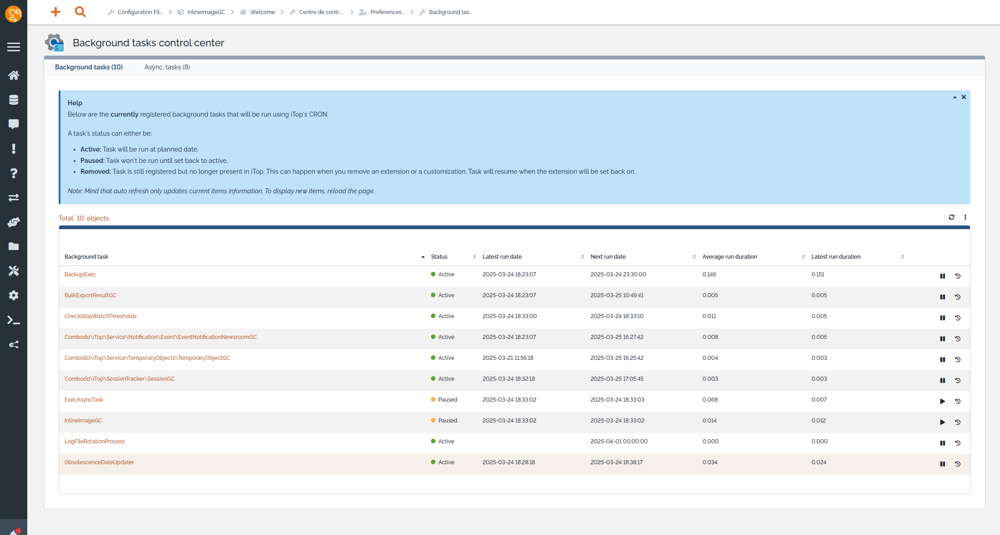
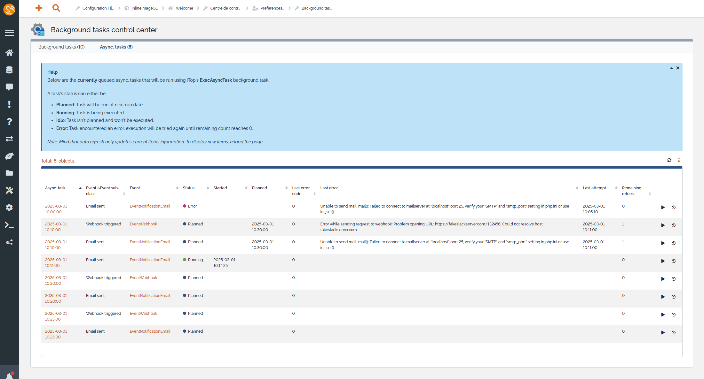
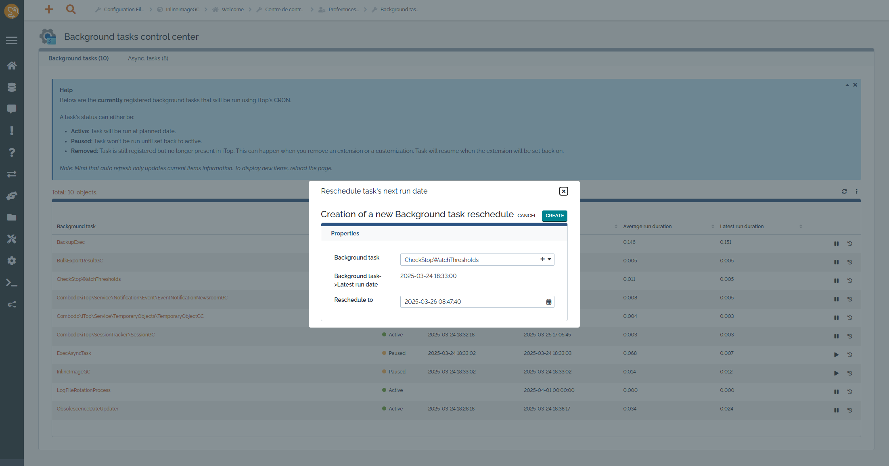

# iTop extension: molkobain-background-tasks-control-center
  * [Description](#description)
  * [Online demo](#online-demo)
  * [Compatibility](#compatibility)
  * [Downloads](#downloads)
  * [Installation](#installation)
  * [Configuration](#configuration)
  * [Change log](CHANGELOG.md)
  * [Q&As](#qas)
  * [Contributors](#contributors)

## Support
If you like this project, you can buy me beer, always appreciated! 🍻😁

[](https://www.paypal.com/cgi-bin/webscr?cmd=_s-xclick&hosted_button_id=BZR88J33D4RG6&source=url)

## Description
Manage background tasks (pause, resume, removed), check their execution time. Also visualize async. tasks currently in queue.

Use cases:
  * Avoid to have a system access to the DB to handle the following operations.
  * Pause a background task that keeps crashing to allow other task to continue running.
  * Reschedule a task to another time frame (e.g. for balancing server load).
  * See async. tasks in error and rerun them.

_Background tasks_


_Async. tasks_


_Task reschedule_


## Online demo
You can try this extension on the online demo. There are some background and async. tasks as an example. Just click on the links below to access it:
  * [Administration console](http://mbc.itop.molkobain.com/pages/UI.php?operation=details&class=UserRequest&id=2&auth_user=admin&auth_pwd=admin) (admin / admin)

## Compatibility
Compatible with iTop 3.2+

## Downloads
Stable releases can be found on [GitHub](https://github.com/Molkobain/itop-background-tasks-control-center/releases).

## Installation
Installation procedure is the same as for any iTop extension, just follow the instruction on the iTop official documentation [here](https://www.itophub.io/wiki/page?id=extensions%3Ainstallation).

### Dependencies
This extension embeds some resources that are necessary for it to work. \
Everything is included in the distributed packages, no extra effort needed.

#### iTop modules
* Module [molkobain-handy-framework](https://github.com/Molkobain/molkobain-handy-framework)
* Module [molkobain-newsroom-provider](https://github.com/Molkobain/molkobain-newsroom-provider)

## Configuration
No configuration needed, the extension can be used out of the box!

### Parameters
Some configuration parameters are available from the Configuration editor of the console:
  * ``task_lists_refresh_interval`` Interval in seconds between 2 auto refresh for the background and async. tasks lists. Default is `10`.

*Example:*
```
'molkobain-background-tasks-control-center' => array (
  'task_lists_refresh_interval' => 10,
),
```

## Q&As
### I don't see any background tasks in the dedicated tab
For background tasks to display, you must have iTop's CRON job running. Check [the documentation](https://www.itophub.io/wiki/page?id=latest:admin:cron) for more information on how to run it.

### I don't see some actions (notifications, webhooks, ...) in the "async. tasks" tab
For actions to display in the "async. tasks" tab:
  * First ensure that iTop's CRON job is running (see [documentation](https://www.itophub.io/wiki/page?id=latest:admin:cron))
  * Then for each type of actions check the `Asynchronous` field
    * If set to `Yes`, you are good to go
    * If set to `False`, ensure that you actually want it to be asynchronous then changed it to `Yes` or `Use global setting` accordingly
    * If set to `Use global setting`, check that the global setting relative to the type of the action is set to `true`
      * For email action: Core conf. param. `email_asynchronous`
      * For newsroom action: Core conf. param. `notifications.itop.send_asynchronously`
      * For webhook action: Module `combodo-webhook-integration` conf. param. `prefer_asynchronous`

## Licensing
This extension is under [AGPLv3](https://en.wikipedia.org/wiki/GNU_Affero_General_Public_License).

## Contributors
I would like to give a special thank you to the people who contributed to this

### Names

* Stetina, Pavel  a.k.a [@Stetinac](https://github.com/Stetinac)
