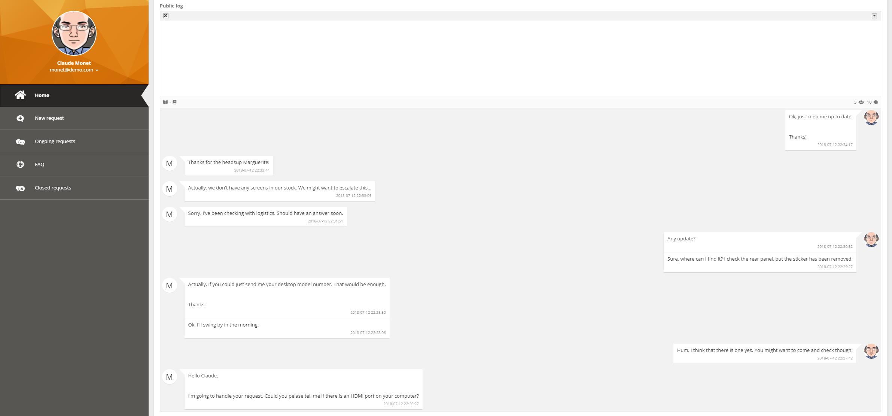
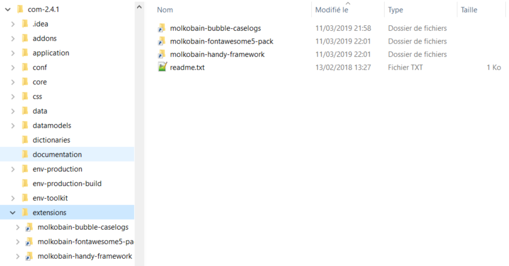

👋 [Available on Molkobain I/O](https://www.molkobain.com/product/bubble-caselogs/)

# iTop extension: molkobain-bubble-caselogs
* [Description](#description)
* [Online demo](#online-demo)
* [Compatibility](#compatibility)
* [Downloads](#downloads)
* [Installation](#installation)
* [Configuration](#configuration)

## Description
This extension changes the look and feel of the caselogs in both the enhanced portal and the console to make it look like modern messaging applications.

It also allows you to:
* Easily distinguish users of the conversation through colors and profile pictures.
* Open / close all messages at once.



## Online demo
You can try this extension on the online demo. There is already a user request with a detailled public log as an example. Just click on the links below to access it:
* [Administration console](http://mbc.itop.molkobain.com/pages/UI.php?operation=details&class=UserRequest&id=2&auth_user=admin&auth_pwd=admin) (admin / admin)
* [Enhanced portal](http://mbc.itop.molkobain.com/pages/exec.php/manage/ongoing-tickets-for-portal-user?exec_module=itop-portal-base&exec_page=index.php&portal_id=itop-portal&auth_user=portal&auth_pwd=portal) (portal / portal)

*Note: Mind to logout before switching between console & portal.*

## Compatibility
Compatible with iTop 2.4+

## Dependencies
* Module `molkobain-fontawesome5-pack/1.1.1`
* Module `molkobain-handy-framework/1.1.0`

## Downloads
Stable releases can be found on [Molkobain I/O](https://www.molkobain.com/product/bubble-caselogs/).

## Installation
* Unzip the extension
* Copy the ``molkobain-bubble-caselogs`` folder under ``<PATH_TO_ITOP>/extensions`` folder of your iTop
* Run iTop setup & select extension *Bubble caselogs*

*Your folders should look like this*



## Configuration
No configuration needed, the extension can be used out of the box!

### Parameters
Some configuration parameters are available from the Configuration editor of the console:
* ``enabled`` Enable / disable the extension without having to uninstall it. Value can be ``true`` or ``false``.
* ``all_entries_opened`` Open all messages by default instead of only the first 2. Value can be ``true`` or ``false``.
* ``reverse_order`` Display messages in a chronological order. Value can be ``true`` or ``false``.
* ``open_all_icon`` CSS classes of the *open* icon, allows you to choose any FontAwesome icon. Value must be a string of CSS classes separated by a space (eg. ``'fas fa-book-open'``).
* ``close_all_icon`` CSS classes of the *close* icon, allows you to choose any FontAwesome icon. Value must be a string of CSS classes separated by a space (eg. ``'fas fa-book'``).
* ``icons_separator`` Separator of the 2 icons. Value must be a string (eg. ``'-'``).

*Example:*
```
'molkobain-bubble-caselogs' => array (
  'enabled' => true,
  'all_entries_opened' => false,
  'reverse_order' => false,
  'open_all_icon' => 'fas fa-book-open',
  'close_all_icon' => 'fas fa-book',
  'icons_separator' => '-',
),
```

## Licensing
This extension is bound by the license you purchased. A license grants you a non-exclusive and non-transferable right to use and incorporate the item in your personal or commercial projects. There are several [licenses available](https://www.molkobain.com/usage-licenses/).
