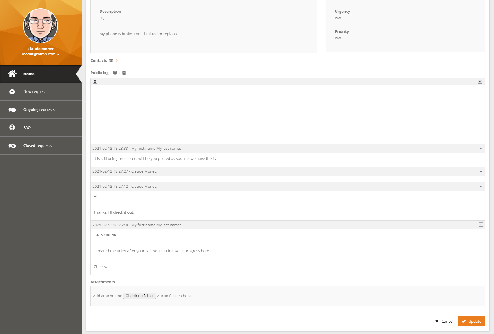

👋 [Available on Molkobain I/O](https://www.molkobain.com/product/caselogs-toggler/)

# iTop extension: molkobain-caselogs-toggler
* [Description](#description)
* [Compatibility](#compatibility)
* [Downloads](#downloads)
* [Installation](#installation)
* [Configuration](#configuration)
* [Change log](CHANGELOG.md)

## Support
If you like this project, you can buy me beer, always appreciated! 🍻😁

[](https://www.paypal.com/cgi-bin/webscr?cmd=_s-xclick&hosted_button_id=BZR88J33D4RG6&source=url)

## Description
Have a better user experience with caselogs by being able to open / close all entries at once.

This extension simply adds 2 buttons next to the caselog title, in both the console & portal.

*Note: For an even better UX, check the **[Bubble caselogs](https://www.molkobain.com/product/bubble-caselogs/)** extension which changes the caselog entries look & feel.*




## Compatibility
Compatible with iTop 2.4 to 2.7\
Obsolete for iTop 3.0+ as it is now directly included in iTop 🙌

## Dependencies
* Module `molkobain-fontawesome5-pack/1.2.0`
* Module `molkobain-handy-framework/1.3.0`
* Module `molkobain-newsroom-provider/1.0.0`

*Note: All dependencies are included in the `dist/` folder, so all you need to do is follow the installation section below.*

## Downloads
Stable releases can be found either on the [releases page](https://github.com/Molkobain/itop-caselogs-toggler/releases) or on [Molkobain I/O](https://www.molkobain.com/product/caselogs-toggler/).

Downloading it directly from the *Clone or download* will get you the version under development which might be unstable.

## Installation
* Unzip the extension
* Copy the ``molkobain-caselogs-toggler`` folder under ``<PATH_TO_ITOP>/extensions`` folder of your iTop
* Run iTop setup & select extension *Caselog entries toggler*

*Your folders should look like this*


## Configuration
No configuration needed, the extension can be used out of the box!

### Parameters
Some configuration parameters are available from the Configuration editor of the console:
* ``enabled`` Enable / disable the extension without having to uninstall it. Value can be ``true`` or ``false``.
* ``open_all_icon`` CSS classes of the *open* icon, allows you to choose any FontAwesome icon. Value must be a string of CSS classes separated by a space (eg. ``'fas fa-book-open'``).
* ``close_all_icon`` CSS classes of the *close* icon, allows you to choose any FontAwesome icon. Value must be a string of CSS classes separated by a space (eg. ``'fas fa-book'``).
* ``icons_separator`` Separator of the 2 icons. Value must be a string (eg. ``'-'``).

*Example:*
```
'molkobain-caselogs-toggler' => array (
  'enabled' => true,
  'open_all_icon' => 'fas fa-book-open',
  'close_all_icon' => 'fas fa-book',
  'icons_separator' => '-',
),
```

## Contributors
I would like to give a special thank you to the people who contributed to this:
 - Bostoen, Jeffrey
 - Goiffon, Pierre

## Licensing
This extension is under [AGPLv3](https://en.wikipedia.org/wiki/GNU_Affero_General_Public_License).
