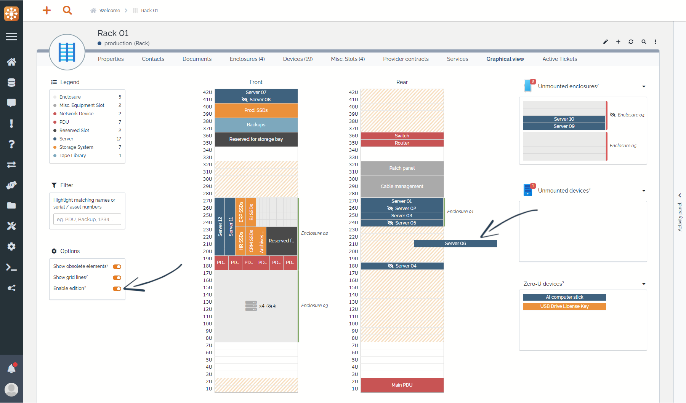

<button onclick="history.back()">Back</button>

# Drag & Drop

The most comfortable way is to position elements in their racks / enclosures is to place them at the right place using your mouse. To do so, just follow those 3 simple steps:

  * Open the desired host and go to the "Graphical view" tab
  * Enable "edition" in the options
  * Drag any elements and drop it hover the host

## Frequent questions

### Why does the element reverts to its origin when I drop it?
This can happen for several reasons:

  * Element is dropped off limits of an host's panels
  * Element is overlapping host's limits
  * Element is overlapping another element

### Why can't I drag elements from the "Zero U devices" panel?
Zero U devices are not meant to be positioned on a specific U of the host as they do not fit the form factor. They are displayed here to help visualize what is in the host but cannot be dragged.

_Typical zero U devices are USB drives, vertical PDUs, ..._

### Why are some of elements displayed in the "unmounted panels"?
Any element displayed in these panels **is linked** to the currently displayed host (rack or enclosure) but is not positioned for one of the following reasons:

  * Element has no position defined (see its position attributes)
  * Element's position is off limits of the host's panels
  * Element's position is overlapping another element