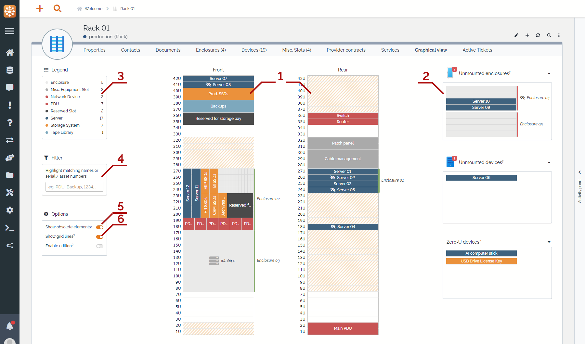
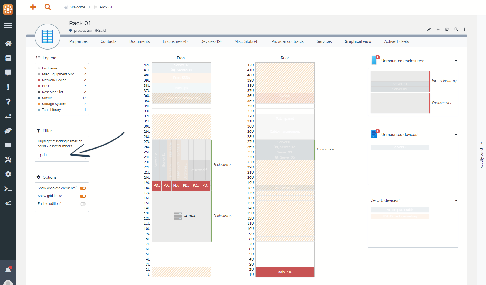
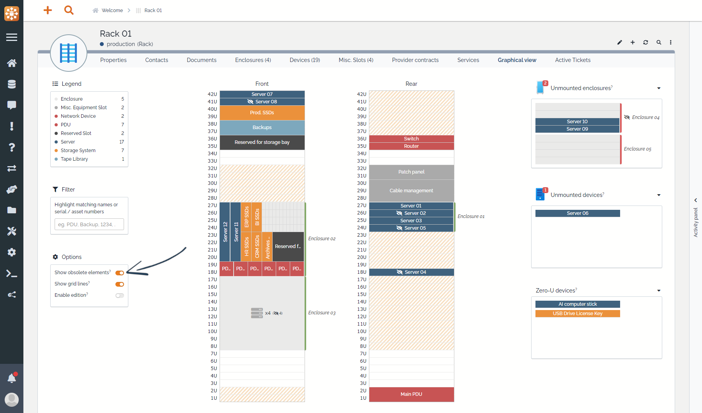

# Graphical tab overview

The extension brings a new "Graphical view" tab on "host" elements (racks and enclosures). Here is an overview of what is available from this screen:

## 1. Panels
Both front and rear panels are displayed to give a complete view of the host element (_Note: In the free version, only front panel is available_).
  * Height of the panels is defined by the `height` attribute of the element, on the `Properties` tab. When changed, the panels size change automatically.
  * When a device is positioned on a panel, occupancy markers are automatically placed on the opposite panel to help visualize which Us are partially occupied.

## 2. Unmounted elements
On the right part of the view are displayed _unmounted elements_, these elements are already linked to the host in iTop but are either:
  * Not positioned yet (position, height, ...)
  * Malpositioned (position is off the host limits, overlapping another element, ...)

All unmounted elements can be easily postioned in the host through drag and drop.

## 3. Legend
Legend summarize what type of elements are present in the host, but it also allows you to quickly see where a specific type of elements are positioned, to do so simply hover on a label.

_Example when hovering on "Server" in the legend, corresponding elements are highlighted_

## 4. Filter
Filter allows you to quickly highlight specific elements from their names, serial or asset numbers.

_Example when typing "pdu" in the filter, only matching elements are highlighted_

## 5. Obsolete elements
By default, the view displays (or not) obsolete elements based the user's preference. This can be overriden by toggling the "Show obsolete elements" option, the choice will be saved for that element only, meaning that you can choose to show obsolete elements on some hosts, but not on others.

_Obsolete elements visible_

_Obsolete elements hidden_

## 6. Grid lines
This option applies only to enclosures with a complex layout, see [dedicated page](./complex-enclosures.md). \
When enabled, vertical lines of the grid will be displayed to ease positioning of elements.
