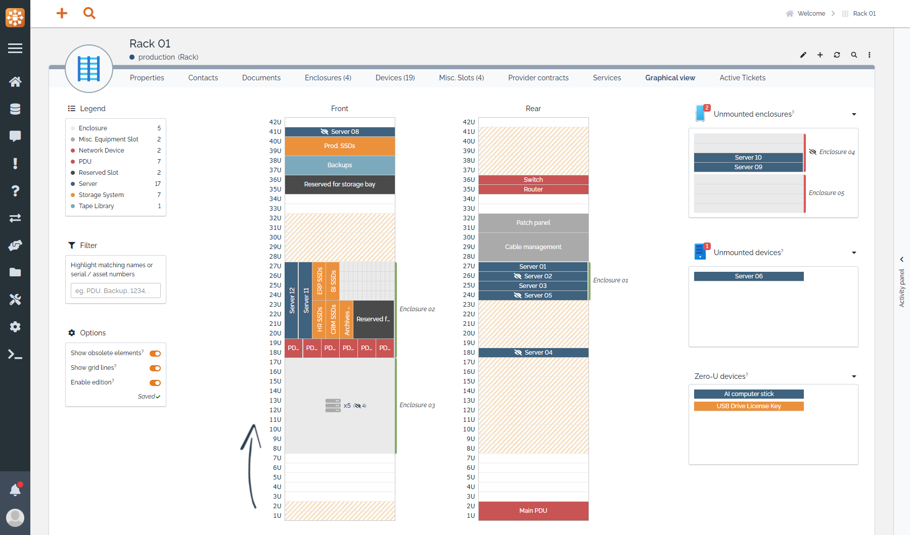
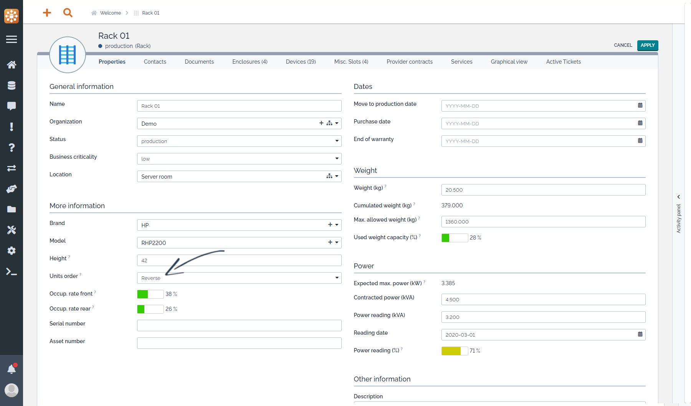
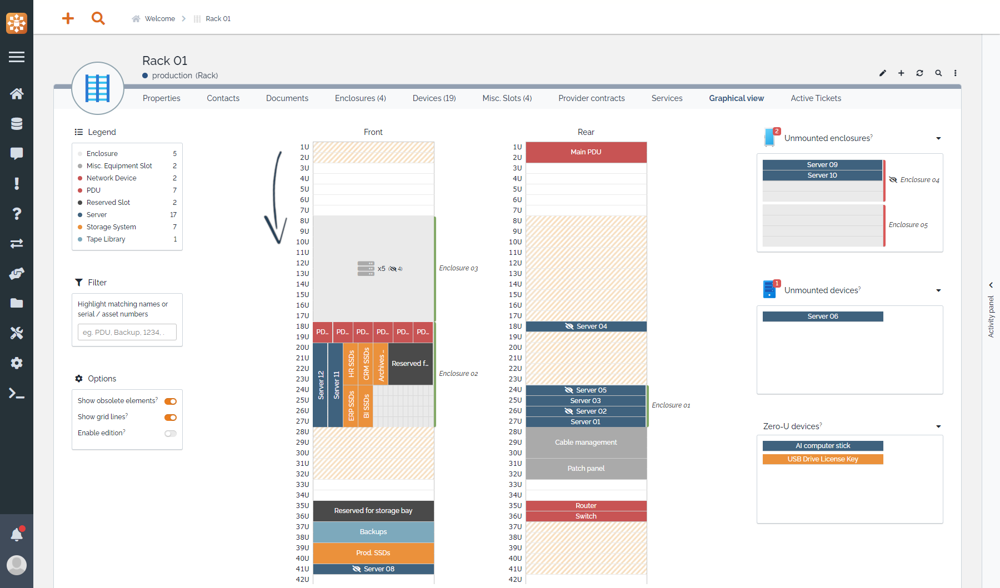
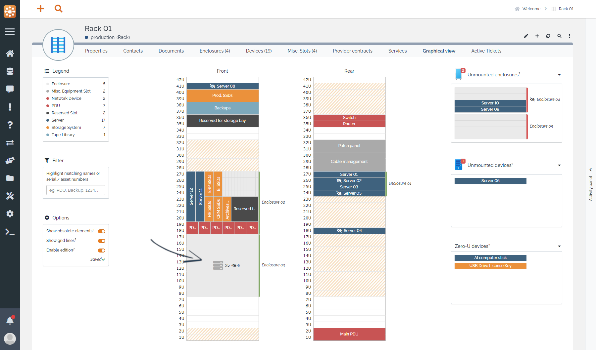

<button onclick="history.back()">Back</button>

# Miscellenous options

## Reversed Us order

By default, Us numbering in racks and enclosures goes from bottom to top.



In case you want the numbering to rather go from top to bottom, you can change "Units order" attribute of the element. \
_Note: Changing it will affect this element only, it is not a global option._





## Enclosure abstract layout

In most cases, an enclosure' ("Grid") layout represents how devices are organized in it, may they be horizontals or verticals, but in some cases devices aren't organized in a way that can be displayed (or organized at all). Setting the "Layout" attribute to "Abstract" can be a good option in such cases as it will only show the number of devices.



## Custom colors

The extension displays datacenter devices with specific colors depending on their classes to help identify them on the overview (blue for servers, red for network devices, ...)


These colors can be changed in the extension's configuration parameters for both standard datamodel classes and your own datamodel classes. 
Under the `custom_device_colors` parameter, simply add valid HTML colors for both `text` and `background` for each class you want to customize.

```
'molkobain-datacenter-view-extended' => array(
    'custom_device_colors' => array(
        'ExampleClassA' => array(
            'text' => '#fff',
            'background' => '#e87c1e',
        ),
        'ExampleClassB' => array(
            'text' => '#fff',
            'background' => '#ff0000',
        ),
    ),
),
```


## Custom datamodel classes

Out of the box, only certain classes of objects can be displayed in the graphical view of racks and enclosure:

  * For a `Rack`, classes deriving from either `Enclosure` or `DatacenterDevice`.
  * For an `Enclosure`, only classes deriving from `DatacenterDevice`.

If you customized the datamodel and added your own classes, you might want to display them in the graphical view even though they don't have the previously mentioned classes as parent. To do so, follow [this tutorial](../tutorials/custom-datamodel-classes.md).

## Location type and hierarchy

To ease documenting where racks are located, the extension adds 2 attributes to the `Location` object:

  * `Type` which points to the new `Location type` typology for types such as _Building, Floor, Room_, totally customizable.
  * `Parent` which points to the parent `Location` (eg. a _Floor_ for a _Room_).
  * `Child locations` which list all `Location` objects having this location as parent.

_Note: Mind that in order to avoid conflicts, this feature is not enabled if you have the **Location Hierarchy** extension installed._

## Frequent questions

### Why are the rack/enclosure's elements upside down after I change the "Units order" attribute?
If you changed the rack/enclosure's units order when it already had some elements positioned, the elements are still positioned according to the vertical position they had prior to the change. You need to adjust their vertical position to fit the new units order.

### How can I apply the reversed unit order to all racks/enclosures?
There is no such option for now but there are workarounds:

  * If you want to change only for existing elements, use the "bulk modify" feature of iTop.
  * If you want to change it for future elements, you'll need to change the default value of the Rack:units_order and Enclosure:units_order attributes. See extension's [datamodel changes](../configuration/datamodel-changes.md) and how to [customize the datamodel](https://www.itophub.io/wiki/page?id=latest%3Acustomization%3Astart#by_writing_your_own_extension).
  