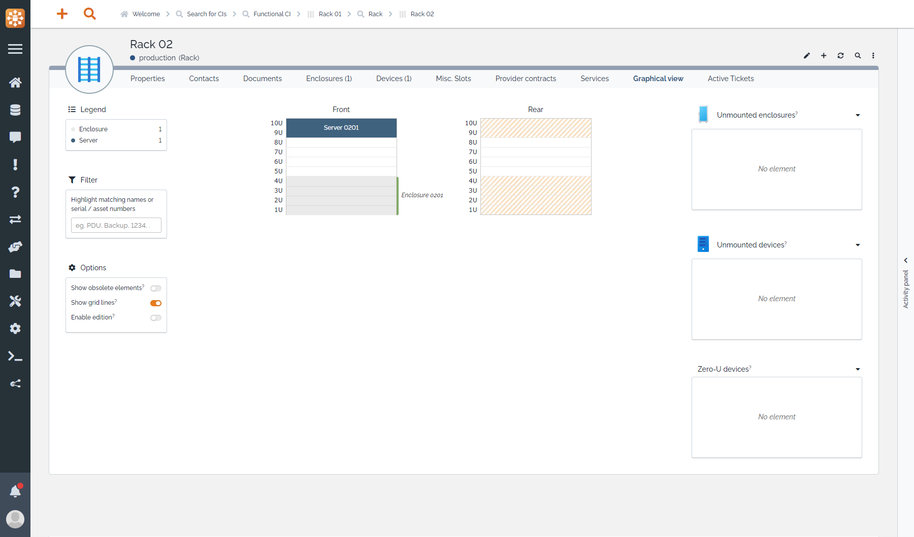
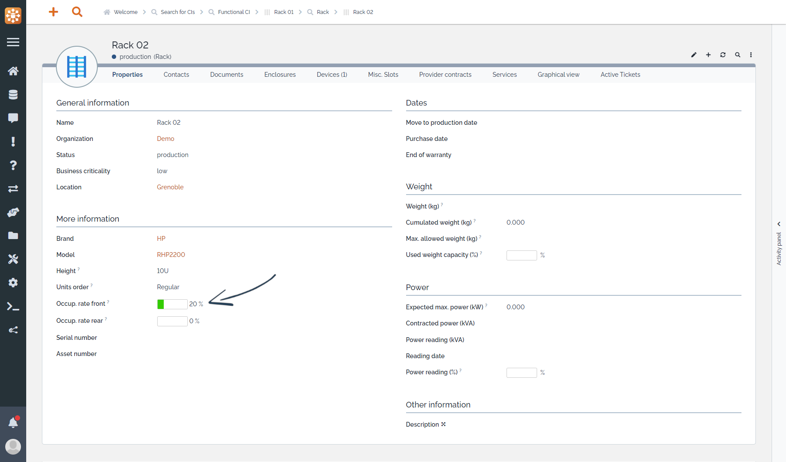
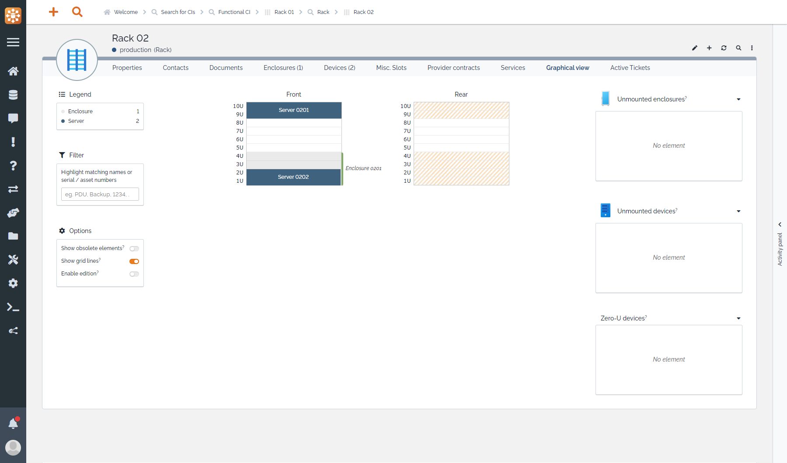
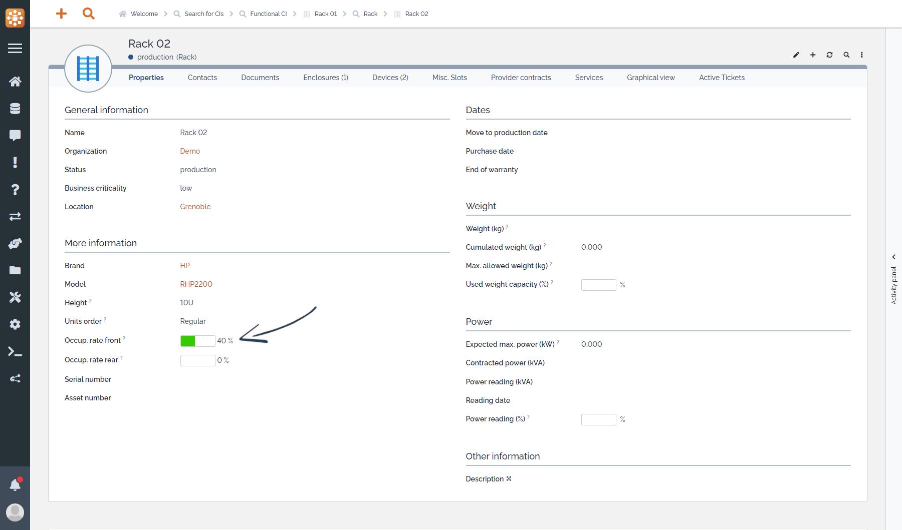
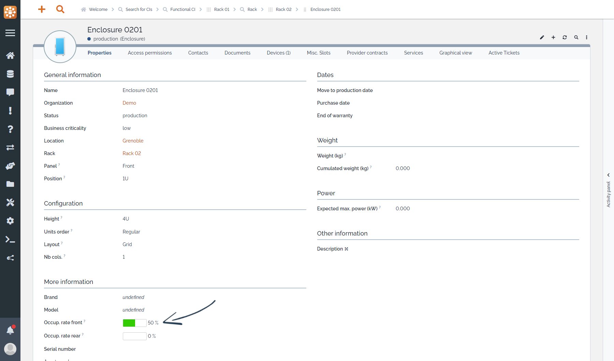
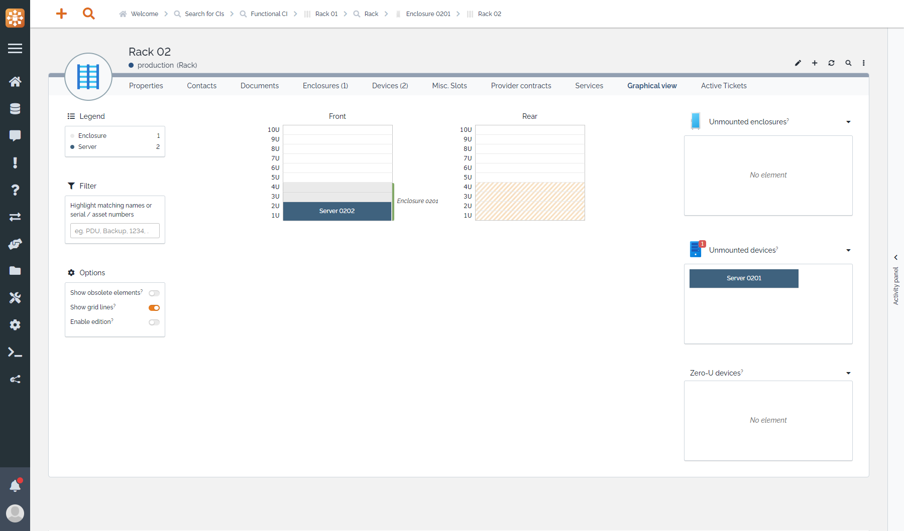
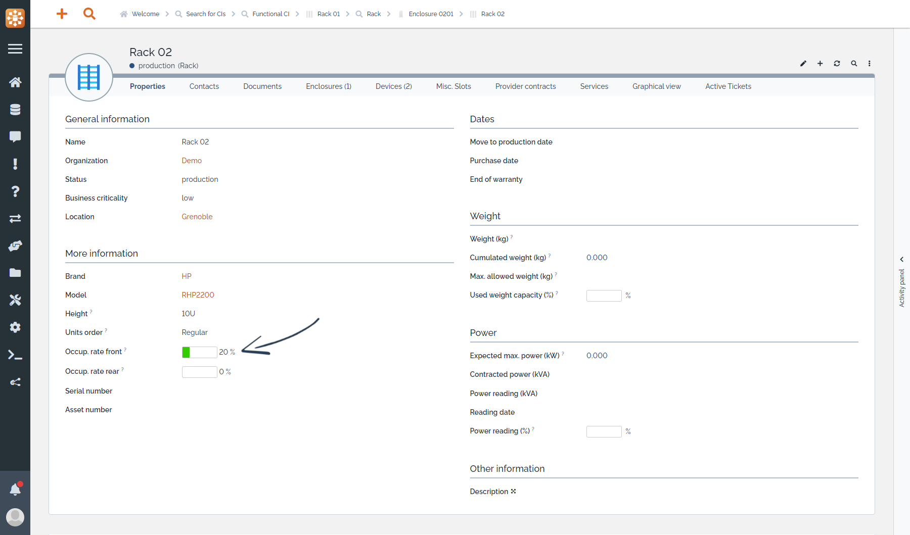

<button onclick="history.back()">Back</button>

# Occupancy rates

In the "Properties" tab of an host element (rack or eclosure), 2 new indicators are present to display the occupancy rate of each panel (front & rear). They are automatically updated when an element is positioned on the host or removed from it.

For the sake of this example, we consider the following rack with a 10Us height, that means 10Us on the front panel and 10Us on the rear panel.

It has one 2Us server and a 4Us empty enclosure. Only the filled Us of the enclosure will be taken into account in the occupancy rate, empty Us won't. So in this example the front panel occupancy rate is 2 / 10 = 20%.

Now if we add another 2Us server in the enclosure, the occupancy rate of the front panel increases to 4 / 10 = 40%.

But if you open the enclosure itself, you'll see that the occupancy rate is 2 / 4 = 50%. \
Occupancy rates are computed and aggregated independantly for each host.

Finally, occupancy rates do not take into account elements that are not positioned (elements in the "unmounted" panels). If we remove one of the server from the rack, the occupancy rate decreases to reflect that.

