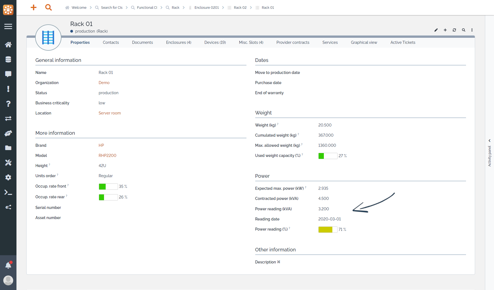

# Power capacity

Keep an eye on your racks power consumption:

  * Fill devices expected consumption
  * Max. expected consumption on each rack & enclosure is automatically computed
  * Compare it with contracted power and actual power reading

In the "Properties" tab of an host element (rack or eclosure), a new "Power" section brings several attributes:

On racks and enclosures

  * `Expected max. power (kW)`: Maximm expected power consumption of the element itself, should be according to the manufacturer specifications

On racks only

  * `Contracted power (kVA)`: Contracted power capacity for the element
  * `Power reading (kVA)`: Last power reading for the element consumption
  * `Reading date`: Date of the last `Power reading`
  * `Power reading (%)`: Ratio of `Power reading` over `Contracted power`