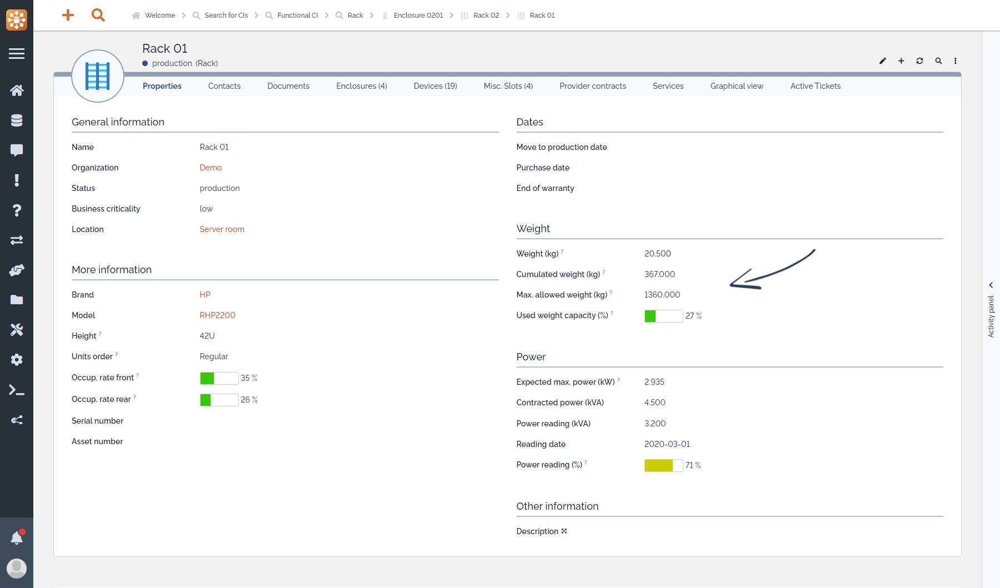

<button onclick="history.back()">Back</button>

# Weight capacity

Keep an eye on your racks & enclosure weight capacity:

  * Fill devices weight
  * Cumulated weight on each rack & enclosure is automatically computed
  * Compare it with the maximum weight allowed by the element itself or the server room specs

In the "Properties" tab of an host element (rack or eclosure), a new "Weight" section brings several attributes:

On both racks and enclosures

  * `Weight (kg)`: Weight of the element itself
  * `Cumulated weight (kg)`: Weight of the element itself and all the elements positioned in it (enclosures, devices, ...)

On racks only

  * `Max. allowed weight (kg)`: Maximum weight allowed for that element, should be set according to the manufacturer specifications
  * `Use weight capacity (%)`: Ratio of `Cumulated weight` over `Max. allowed weight`