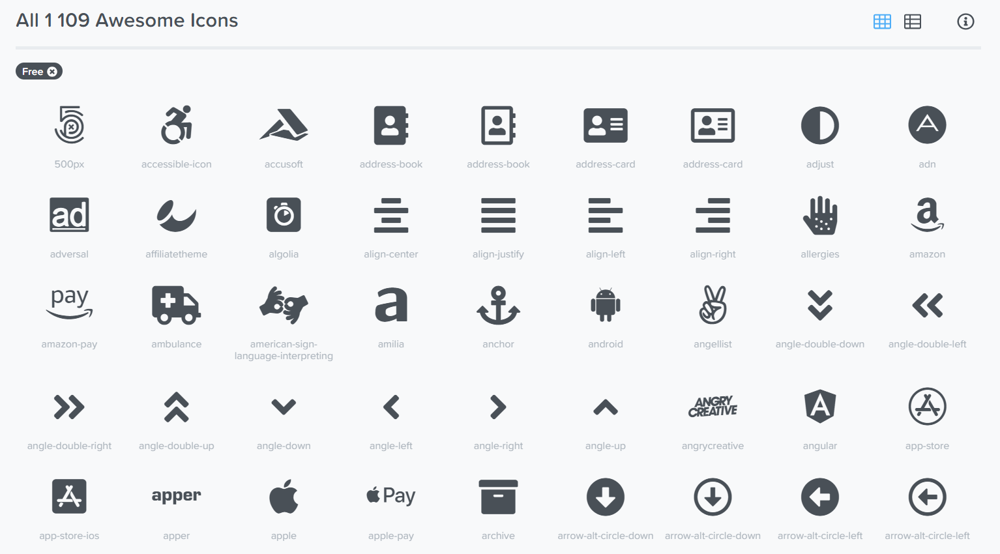
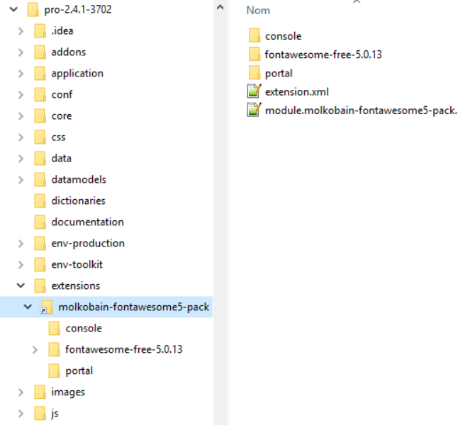
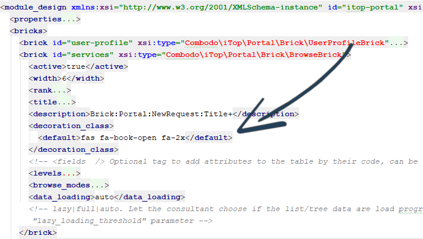
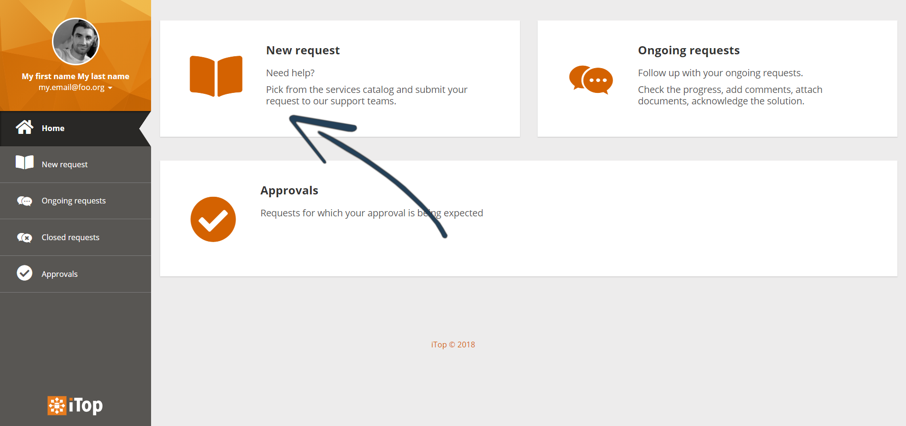

👋 [Available on Molkobain I/O!](https://www.molkobain.com/product/font-awesome-5-pack/)

# iTop extension: molkobain-fontawesome5-pack
* [Description](#description)
* [Compatibility](#compatibility)
* [Downloads](#downloads)
* [Installation](#installation)
* [Configuration](#configuration)
* [How to](#how-to)
* [Change log](CHANGELOG.md)

## Support
If you like this project, you can buy me beer, always appreciated! 🍻😁

## Description
Use [Font Awesome 5.15.3](https://fontawesome.com/) new icon sets in both portal & console.

## Compatibility
- **Compatible** with iTop 2.4, 2.5, 2.6.
- **Obsolete** with iTop 2.7 and later as Font Awesome v5 was reintegrate in iTop's core.

## Downloads
Stable releases can be found either on the [releases page](https://github.com/Molkobain/itop-fontawesome5-pack/releases) or on [Molkobain I/O](https://www.molkobain.com/product/font-awesome-5-pack/).

Downloading it directly from the *Clone or download* will get you the version under development which might be unstable.

## Installation
* Unzip the extension
* Copy the ``molkobain-fontawesome5-pack`` folder under ``<PATH_TO_ITOP>/extensions`` folder of your iTop
* Run iTop setup & select extension *Font Awesome 5*

*Your folders should look like this*

## Configuration
No configuration needed.

## How to
### Portal: Change a brick's icon
Let's say that for example you would like to change the *New request* icon with [this one](https://fontawesome.com/icons/book-open?style=solid). Just alter the portal XML to change the ``/itop_design/module_designs/module_design[@id="<PORTAL_ID>"]/bricks/brick[@id="services"]/decoration_class/default`` tag value with *fas fa-book-open fa-2x*

*XML before*

*XML after*

Run iTop setup and your portal home page should look like this!

*Result*

## Licensing
This extension is under [AGPLv3](https://en.wikipedia.org/wiki/GNU_Affero_General_Public_License).
