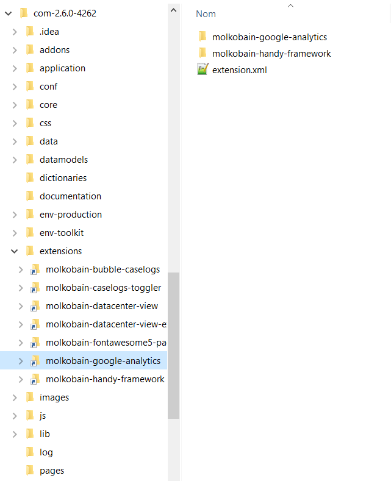

👋 [Available on Molkobain I/O](https://www.molkobain.com/product/google-analytics/)

# iTop extension: molkobain-google-analytics
* [Description](#description)
* [Compatibility](#compatibility)
* [Downloads](#downloads)
* [Installation](#installation)
* [Configuration](#configuration)

## Description
Enable Google Analytics reporting on your iTop instance within seconds! Just put your tracking code in the configuration file and your are good to go. Reporting can be enabled on both the admin. console and the end-user portal.

Features:
* Works on both the admin. console and end-user portal.
* Different tracking codes can be set to the admin. console and end-user portal.
* Supports multi end-user portal setups, just add portal IDs in the configuration file.
* Option to not track specific users or profiles (eg. administrators).

## Compatibility
Compatible with iTop 2.4+

## Downloads
Stable releases can be found either on the [releases page](https://github.com/Molkobain/itop-google-analytics/releases) or on [Molkobain I/O](https://www.molkobain.com/product/google-analytics/).

Downloading it directly from the *Clone or download* will get you the version under development which might be unstable.

## Installation
* Unzip the extension
* Copy the ``molkobain-google-analytics`` folder under ``<PATH_TO_ITOP>/extensions`` folder of your iTop
* Run iTop setup & select extension *Google Analytics: Tracking code integration*

*Your folders should look like this*



## Configuration
Get tracking codes from Google Analytics' website and put them in the tracking_codes parameter (see below).

### Parameters
The extension has only 2 configuration parameters:
  * `enabled`: Enable or disable extension. Possible values are `true`|`false`, default is `true`.
  * `tracking_codes`: Tracking code for each iTop "portal". `backoffice` being the admin. console, `itop-portal` the standard end-user portal. You can add any other end-user portal instance you have by adding `'PORTAL_ID' => 'TRACKING_CODE',` to the list.
  * `ignored_profiles`: Ignore specific profiles with a list of profiles. Value must be an array of profiles (eg. `array('Administrator')`), default is an empty array.
  * `ignored_users`: Ignore specific users with a list of user logins. Value must be an array of logins (eg. `array('admin', 'test-user')`), default is an empty array.

*Example:*
```
'molkobain-google-analytics' => array (
  'enabled' => true,
  'tracking_codes' => array (
    'backoffice' => 'FIRST_TRACKING_CODE',
    'itop-portal' => 'SECOND_TRACKING_CODE',
  ),
  'ignored_profiles' => array(),
  'ignored_users' => array(),
),
```


## Licensing
This extension is under [AGPLv3](https://en.wikipedia.org/wiki/GNU_Affero_General_Public_License).
