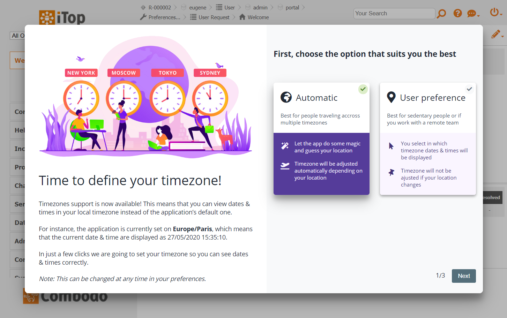
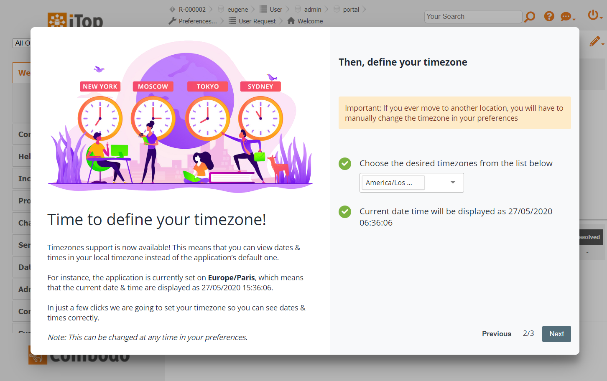
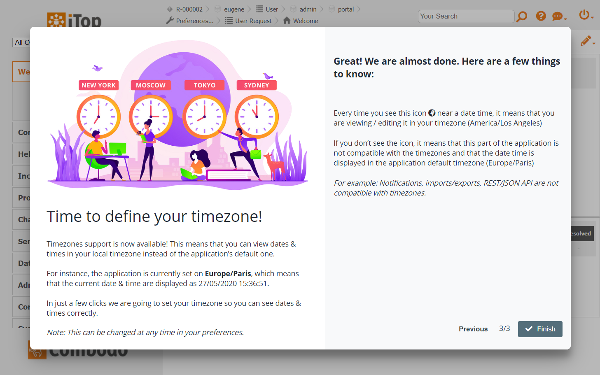
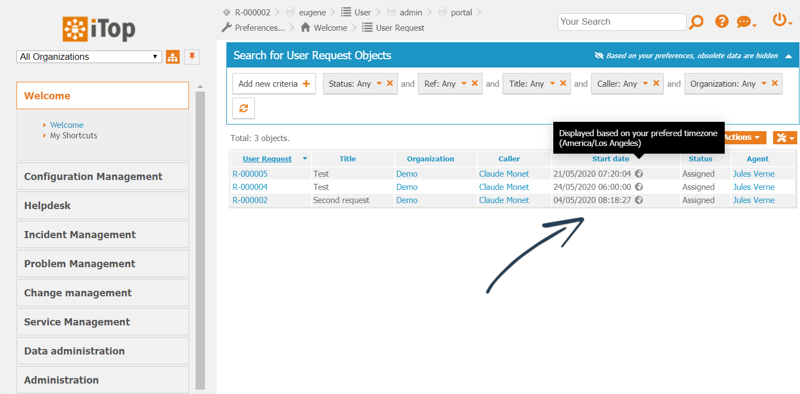
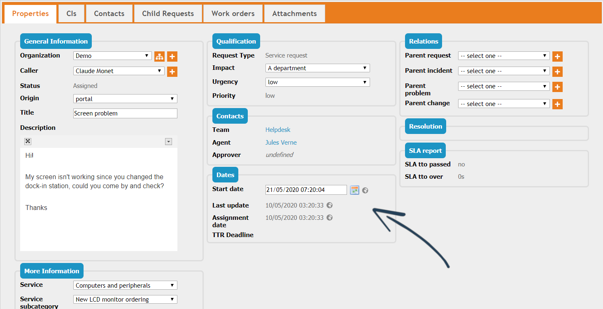
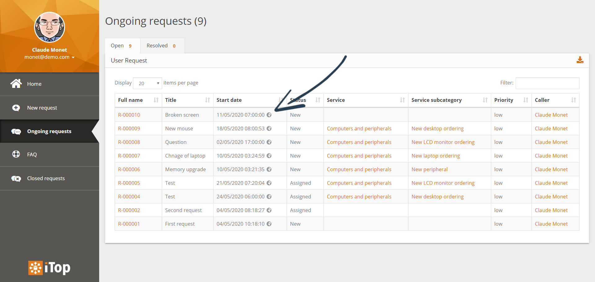

👋 [Available on Molkobain I/O!](https://www.molkobain.com/product/multiple-timezones-support/)

# iTop extension: Multiple Timezones Support
* [Description](#description)
* [Limitations](#limitations)
* [Installation & configuration](#installation--configuration)
* [Downloads](#downloads)
* [Third parties](#third-parties)

## Support
If you like this project, you can buy me beer, always appreciated! 🍻😁

## Description
Allow users to see or edit dates & times in their own timezone instead of the server's default one. Perfect for:

  * Companies with employees or customers accross several countries
  * Planning changes safely with everyone seeing the right time (no more math!)

### User setup
Easy on the users with a simple wizard to set up their timezone, they can either choose to let the app find their timezone and adjust it when they travel...

... or they can choose a specific timezone and stick to it (useful when working with a remote team) ...

... and, that's all! Timezone can be changed at any time in the user preferences.

### How it looks
Any dates & times attributes in the UI will automatically be converted, a small icon indicates that it is now displayed in the user's timezone. (see [limitations](#limitations)). Works in both the backoffice and the end-users portal.

*Backoffice lists*

*Backoffice object details*

*Portal lists*

## Limitations
**IMPORTANT: Before buying it, make sure you have read the following limitations.**

For the moment some parts of the application are NOT compatible with the timezones:

  * Notifications
  * Imports / exports
  * REST/JSON API
  * SLA computations are made based on the iTop server timezone, but on the user’s
  * End-user portal log entries can't be converted if date/time format is not the default one due to lack of metadata
  * **[iTop 2.7.x]** Backoffice log entries can’t be converted due to lack of metadata
  * **[iTop 2.7.x]** Tables that are automatically refreshed

## Installation & configuration
* [Installation](docs/configuration/installation.md)
* [Configuration parameters](docs/configuration/configuration-parameters.md)
* [Change log](./CHANGELOG.md)

## Downloads
Stable releases can only be found on [Molkobain I/O](https://www.molkobain.com/product/multiple-timezones-support/).

## Third parties
This extension embeds some third-party resources:

  * [Moment Timezone](https://momentjs.com/timezone/) for dates & times manipulations
  * Cover image used in the wizard & documentation is from [RAStudio](https://www.vectorstock.com/royalty-free-vectors/vectors-by_RAStudio)