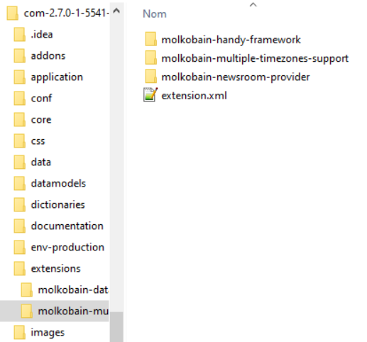

👋 [Available on Molkobain I/O!](https://www.molkobain.com/product/multiple-timezones-support/)

# iTop extension: Multiple Timezones Support
* [Description](#description)
* [Limitations](#limitations)
* [Compatibility](#compatibility)
* [Downloads](#downloads)
* [Installation](#installation)
* [Configuration](#configuration)
* [Third parties](#third-parties)

## Support
If you like this project, you can buy me beer, always appreciated! 🍻😁

[](https://www.paypal.com/cgi-bin/webscr?cmd=_s-xclick&hosted_button_id=BZR88J33D4RG6&source=url)

## Description
Allow users to see or edit dates & times in their own timezone instead of the server's default one. Perfect for:
 - Companies with employees or customers accross several countries
 - Planning changes safely with everyone seeing the right time (no more math!)


### User setup
Easy on the users with a simple wizard to set up their timezone, they can either choose to let the app find their timezone and adjust it when they travel...


... or they can choose a specific timezone and stick to it (useful when working with a remote team) ...


... and, that's all! Timezone can be changed at any time in the user preferences.


### How it looks
Any dates & times attributes in the UI will automatically be converted, a small icon indicates that it is now displayed in the user's timezone. (see [limitations](#limitations)). Works in both the backoffice and the end-users portal.

*Backoffice lists*


*Backoffice object details*


*Portal lists*


## Limitations
For the moment some parts of the application are NOT compatible with the timezones:
- Notifications
- Imports / exports
- REST/JSON API

## Compatibility
Only compatible with iTop 2.7+

## Downloads
Stable releases can only be found on [Molkobain I/O](https://www.molkobain.com/product/multiple-timezones-support/).

## Installation
* Unzip the extension
* Copy the ``molkobain-multiple-timezones-support`` folder under ``<PATH_TO_ITOP>/extensions`` folder of your iTop
* Run iTop setup & select extension *Multiple timezones support*

*Your folders should look like this*



## Configuration
No configuration needed, each user will be prompt to choose its timezone on next login.

### Parameters
Some configuration parameters are available from the Configuration editor of the console:
* `enabled` Enable / disable the extension without having to uninstall it. Value can be `true` or `false`.
* `disabled_guis` Specify for which GUIs the extension should be disabled, for example if you only want to use it in the backoffice and not in the end-users portal. Values can be `backoffice`, `itop-portal` or any other portal instance ID.

*Default values:*
```
'enabled' => true,
'disabled_guis' => array(),
```

## Third parties
This extension embeds some third-party resources:
- [Moment Timezone](https://momentjs.com/timezone/) for dates & times manipulations
- Cover image used in the wizard & documentation is from [RAStudio](https://www.vectorstock.com/royalty-free-vectors/vectors-by_RAStudio)